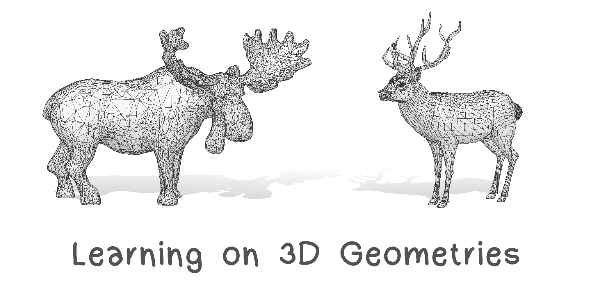

# PhD School: Learning On 3D Geometries
La Statale Università degli Studi di Milano

This is the Repository for the course Learning On 3D Geometries, yields at the La Statale Università degli Studi di Milano, in September 2021.

**Lecturer:** Simone Melzi [website](https://sites.google.com/site/melzismn/), Marco Tarini [website](http://tarini.di.unimi.it/)

**When:** 

      Monday 13/09/2021    14.30 - 17.50

      Wednesday  15/09/2021    14.30 - 17.50
      
      Thursday  16/09/2021    14.30 - 17.50
      
      Wednesday  22/09/2021    14.30 - 17.50
       

**Date** | **Topic** | **Code & Data** | **Reading** | **Extra**
------------ | ------------- | ------------ | ------------ | ------------
| | |
Mon 13 Sep | Introduction and 3D representations | [input.ipynb](https://github.com/melzismn/Digital-Design-2020-2021/blob/master/input.ipynb) | | |
| | |
Wen 15 Sep | 3D Problems and Application | | |
| | |
Thu 16 Mar | Geometric Deep Learning  | | | |
| | |
Wen 22 Sep | AI and 3D |[PointNet_Demo.ipynb](https://github.com/melzismn/Digital-Design-2020-2021/blob/master/PointNet_Demo.ipynb) | [Qi et al. 2017](https://arxiv.org/pdf/1612.00593.pdf)| |
| | |

Click on the following Binder button to lunch the environment for the exercises: 
