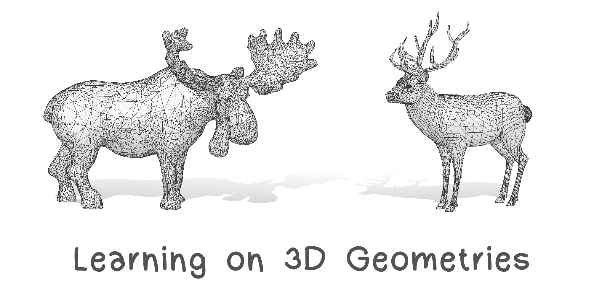

# PhD School: Learning On 3D Geometries
UniMi - University of Milan "La Statale" 

This is the Repository for the course Learning On 3D Geometries, yields at the La Statale Università degli Studi di Milano, in September 2021.

**Lecturers:** Simone Melzi [website](https://sites.google.com/site/melzismn/), Marco Tarini [website](http://tarini.di.unimi.it/)

**When:** 

      Monday 13/09/2021    14.30 - 17.30

      Wednesday  15/09/2021    14.30 - 17.30
      
      Thursday  16/09/2021    14.30 - 17.30
      
      Wednesday  22/09/2021    14.30 - 17.30
       

**Date** | **Topic** | **Code & Data** | **Reading** | **slides**
------------ | ------------- | ------------ | ------------ | ------------
| | |
Mon 13 Sep | Introduction and 3D representations | [input.ipynb](https://github.com/melzismn/Digital-Design-2020-2021/blob/master/input.ipynb) | | [introAI.pdf](https://github.com/melzismn/LearningOn3Dgeometries/blob/b7f67a74aa4f50758082a1f6653bb285d501b712/slides/L1%20-%20Intro%20AI%20and%20Deep%20Learning.pdf)|
| | |
Wen 15 Sep | 3D Problems and Application | | [GeoPro.pdf](https://github.com/melzismn/LearningOn3Dgeometries/blob/c284267f5441b1067f4a86261a9ee9719db5b197/slides/Geometry%20Processing.pdf)|
| | |
Thu 16 Sep | Geometric Deep Learning  | | | [3D-AI.pdf](https://github.com/melzismn/LearningOn3Dgeometries/blob/c284267f5441b1067f4a86261a9ee9719db5b197/slides/3D%20AI%20and%20Deep%20Leraning.pdf)|
| | |
Wen 22 Sep | AI and 3D |[PointNet_Demo.ipynb](https://github.com/melzismn/Digital-Design-2020-2021/blob/master/PointNet_Demo.ipynb) | [Qi et al. 2017](https://arxiv.org/pdf/1612.00593.pdf)| |
| | |

Click on the following Binder button to lunch the environment for the exercises: 
